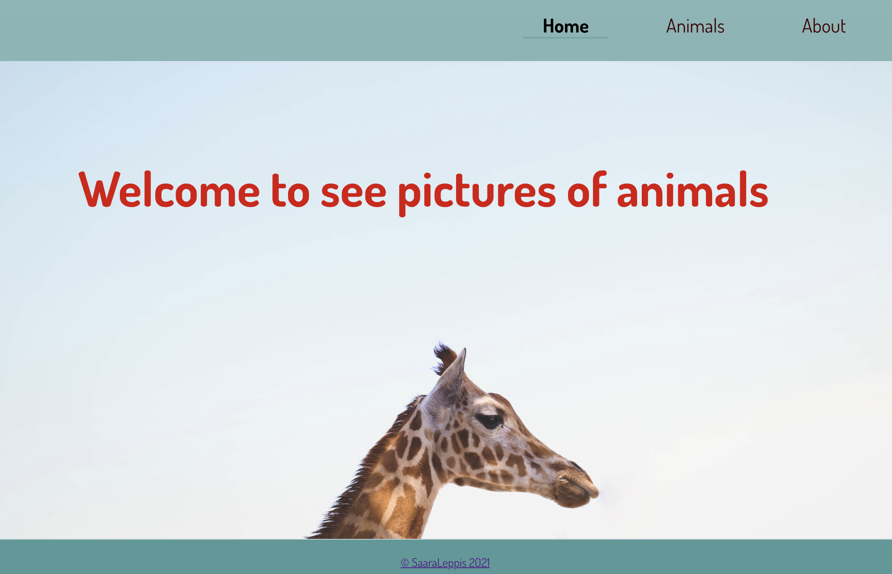
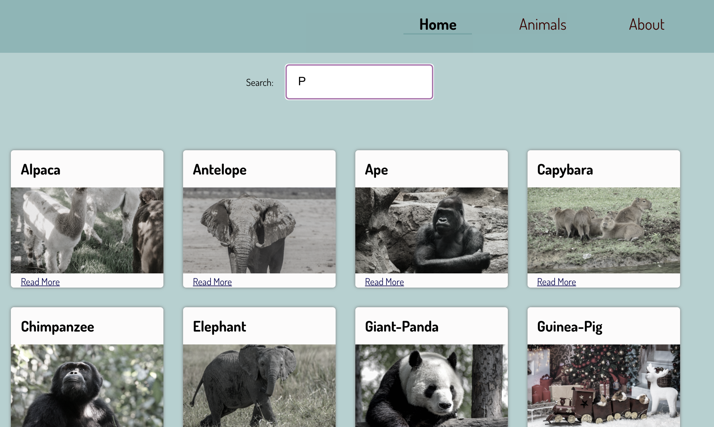

# Animals-application

This is a school project with REACT.

Started after some weeks of React experience and finished by 9 weeks of studies.

## Built with

- REACT
- JavaScript / JSX
- CSS

- first project with React Router (version 5 used)

## What this application is about?

It gets animals' pictures from [Unsplash page](https://unsplash.com/) based on searched animal name. Each animal has own card with picture and "Read more" -link.
Link opens the card to separate page with bigger picture of selected animal. On this page is also a link to Wikipedia of that animal (if page exists).

## Learned and technics used

- Usage of React router
- Class and Function components
- some hooks
  Runs the app in the development mode.

The page will reload if you make edits.\
You will also see any lint errors in the console.

## To run the application

```zsh
- npm install
```

## Screenshots





## Credits

Home page photo by <a href="https://unsplash.com/@katietreadway?utm_source=unsplash&utm_medium=referral&utm_content=creditCopyText">Katie Treadway</a> on <a href="https://unsplash.com/s/photos/wallpaper-animals?utm_source=unsplash&utm_medium=referral&utm_content=creditCopyText">Unsplash</a>
